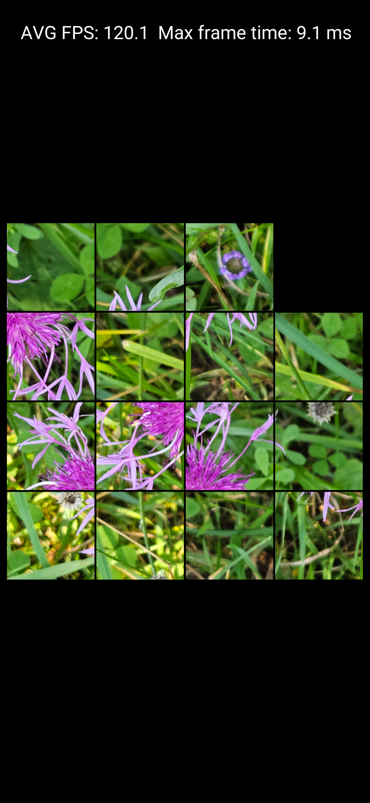
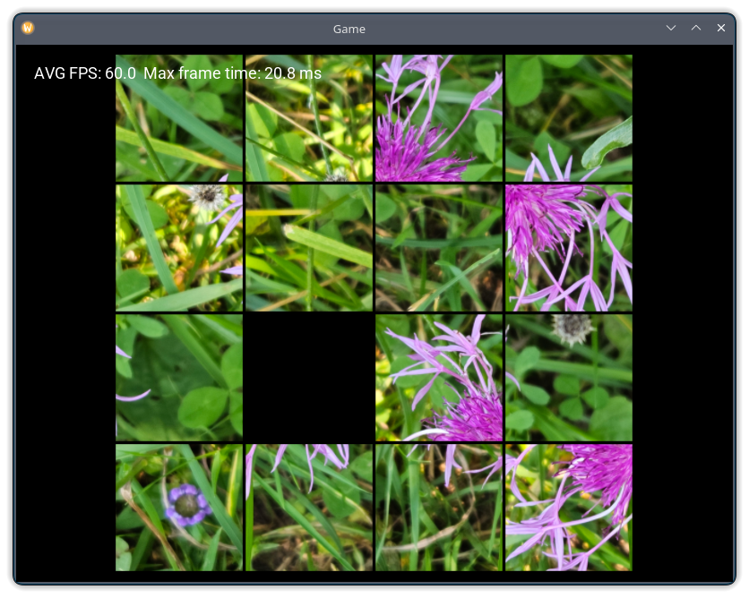

# Tile Puzzle
A simple puzzle game using [my game engine](https://github.com/Mandeson/Engine.git).
The 15 tiles can be moved around to fill one empty space.
It can be done by clicking with mouse or touching (on Android) the tile that the player wants to move.
The player can rearrange the tiles to form a picture of a flower.
The moving tiles are animated using a smooth transition curve.

The game running on Android:

On Linux:

### Supported platforms
* Android
* Linux
* Windows
* MacOS

### Requirements
* GPU compatible with one of the following:
  * OpenGL 3.0+
  * OpenGL 2.1 with GL_EXT_framebuffer_object extension
  * OpenGL ES 2.0

### Building
#### Android
Open ```android``` folder in Android Studio (Panda or newer, with NDK installed), connect a supported Android device with USB Debugging enabled and click _Run_ or _Debug_. The required libraries will be automatically downloaded.
#### Linux
**Prerequisites**:
* GCC 13+ or Clang 17+
* glibc 2.37
* CMake 3.6+

The easiest way to build on any GNU/Linux distribution is to download and compile dependencies automatically alongside the engine:

```
cmake -DENGINE_USE_SYSTEM_LUA_LIB=OFF -DENGINE_USE_SYSTEM_GLM_LIB=OFF -DENGINE_USE_SYSTEM_FREETYPE_LIB=OFF -DENGINE_USE_SYSTEM_NLOHMANN_JSON_LIB=OFF -DENGINE_USE_SYSTEM_GLFW_LIB=OFF -DCMAKE_POLICY_VERSION_MINIMUM=3.5 -DCMAKE_BUILD_TYPE=Release -B build -S .
cd build
make -j16
```
Alternatively, install required libraries (Lua, glm, freetype, nlohmannjson and GLFW) with a package manager and run
```
cmake -DCMAKE_BUILD_TYPE=Release -B build -S .
cd build
make -j16
```
Then run the game (the program binary is located in the parent folder):
```
cd ..
./TilePuzzle
```
#### Windows
**Prerequisites**:
* MSVC 2019 version 16.10 or newer with Build Tools
* CMake 3.6+

Open Microsoft x64 Native Tools Command Prompt. Enter the project directory. Type:
```
cmake -DCMAKE_POLICY_VERSION_MINIMUM=3.5 -DCMAKE_BUILD_TYPE=Release -G "NMake Makefiles" -B build -S .
cd build
nmake
```
Then run _TilePuzzle.exe_ in the parent folder
#### MacOS
**Prerequisites**:
* Apple Clang 17+
* CMake 3.6+

Open CMake GUI. Select the project folder and create a build folder. Add variable **CMAKE_POLICY_VERSION_MINIMUM** and set it to _3.5_. Then click Configure and Generate. The required libraries will be automatically downloaded. Enter the build folder in a terminal and type:
```
make -j16
```
Then enter the root repo folder and launch the game:
```
./TilePuzzle
```
